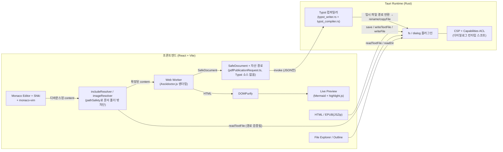

# AsciiDoc Studio — 기술 스택 문서

Tauri v2 + React + Monaco Editor + Asciidoctor.js 기반 AsciiDoc 저작/출판 데스크톱 앱에서 사용한 오픈소스 스택과 각 구성 요소의 채택 이유를 정리한 문서입니다.

## 1. 아키텍처 개요

## 2. 데스크톱 런타임

| 기술                                                                                          | 버전 | 역할                                                                                                                                                                                                                            |
| --------------------------------------------------------------------------------------------- | ---- | ------------------------------------------------------------------------------------------------------------------------------------------------------------------------------------------------------------------------------- |
| [Tauri](https://tauri.app/)                                                                   | v2   | Rust 기반 데스크톱 셸. 웹뷰(OS 네이티브 WebView)를 렌더러로 쓰고, 파일시스템/다이얼로그/프린트 등 OS 기능을 최소 권한(Capabilities ACL) 모델로 프론트엔드에 노출. Electron 대비 바이너리 크기와 메모리 사용량이 훨씬 작아 채택. |
| [tauri-plugin-fs](https://github.com/tauri-apps/plugins-workspace/tree/v2/plugins/fs)         | 2.x  | 파일 읽기/쓰기/디렉터리 목록. 문서 열기·저장, 파일 탐색기, 크래시 복구 스냅샷, EPUB 이미지 번들링에 사용.                                                                                                                       |
| [tauri-plugin-dialog](https://github.com/tauri-apps/plugins-workspace/tree/v2/plugins/dialog) | 2.x  | 네이티브 파일/폴더 선택 다이얼로그, 확인(`ask`)/알림(`message`) 다이얼로그.                                                                                                                                                     |
| [Cargo](https://doc.rust-lang.org/cargo/) (serde, serde_json)                                 | —    | Rust 빌드/직렬화와 로컬 검색 인덱스 구현에 사용.                                                                                                                                                                                |

**Capabilities ACL 정책**: `fs:allow-*` 항목은 파일시스템 명령의 사용만 허용하며, 자체적으로 경로 전체를 열지 않습니다. 파일·폴더 선택 다이얼로그가 사용자가 고른 항목을 런타임 스코프에 추가하므로, 문서와 볼트 폴더에만 접근할 수 있습니다. 신뢰할 수 없는 AsciiDoc의 `include::`/`image::` 경로 탈출은 애플리케이션 레벨 `pathSafety.ts`(§5)가 추가로 차단합니다.

## 3. 프론트엔드 코어

| 기술                                                                              | 버전 | 역할                                                                                                                                                                                                                                                                              |
| --------------------------------------------------------------------------------- | ---- | --------------------------------------------------------------------------------------------------------------------------------------------------------------------------------------------------------------------------------------------------------------------------------- |
| [React](https://react.dev/)                                                       | 19.x | UI 렌더링. 함수형 컴포넌트 + 훅 기반으로 전체 UI 구성.                                                                                                                                                                                                                            |
| [Vite](https://vite.dev/)                                                         | 8.x  | 개발 서버 + 번들러. HMR, 워커 번들링(`?worker` import), 코드 스플리팅에 사용.                                                                                                                                                                                                     |
| [TypeScript](https://www.typescriptlang.org/)                                     | 5.8  | 정적 타입. `strict` 모드 활성화.                                                                                                                                                                                                                                                  |
| [@vitejs/plugin-react](https://github.com/vitejs/vite-plugin-react)               | 6.x  | Vite에서 React Fast Refresh 지원.                                                                                                                                                                                                                                                 |
| [Tailwind CSS](https://tailwindcss.com/) v4 + [shadcn/ui](https://ui.shadcn.com/) | 4.x  | 헤더·파일 탐색기·다이얼로그 등 앱 UI를 구성한다. shadcn/ui 컴포넌트는 `src/components/ui/*`에 직접 두어 커스터마이징하며, `index.css`의 시맨틱 토큰으로 기존 라이트·다크 팔레트와 통합한다. 라이브 프리뷰·HTML·EPUB의 발행 테마 CSS(`styles/themes/*.css`)는 독립적으로 유지한다. |

## 4. 에디터 & 신택스 하이라이팅

| 기술                                                        | 버전  | 역할                                                                                                                                                                                                                                                                                                                                                                             |
| ----------------------------------------------------------- | ----- | -------------------------------------------------------------------------------------------------------------------------------------------------------------------------------------------------------------------------------------------------------------------------------------------------------------------------------------------------------------------------------- |
| [monaco-editor](https://github.com/microsoft/monaco-editor) | 0.56  | VS Code와 동일한 코드 에디터 엔진. `@monaco-editor/react` 래퍼 없이 `monaco.editor.create()`로 직접 마운트(vanilla 패턴)하여, 컨트롤드 `value` prop으로 인한 커서 튐/IME 조합 문제를 `isUpdatingFromProp` 플래그로 직접 제어. CDN 로더 대신 로컬 ESM 에디터 API와 필요한 contribution만 번들에 포함해 CSP `script-src 'self'`와 오프라인 환경에서도 동작하도록 구성.             |
| [Shiki](https://shiki.style/)                               | 4.x   | TextMate 문법 기반 신택스 하이라이팅 엔진. VS Code 공식 Asciidoctor 확장이 쓰는 것과 동일한 `asciidoc` TextMate grammar를 그대로 사용해, 직접 작성한 Monarch 토크나이저보다 훨씬 정교한 하이라이팅을 확보.                                                                                                                                                                       |
| [@shikijs/monaco](https://shiki.style/packages/monaco)      | 4.x   | Shiki의 TextMate 토크나이징 결과를 Monaco의 토큰 프로바이더 API에 연결하는 어댑터.                                                                                                                                                                                                                                                                                               |
| [monaco-vim](https://github.com/brijeshb42/monaco-vim)      | 0.4.x | Monaco에 Vim 키바인딩 추가. `o`/`O`가 위임하는 Monaco 액션(`insertLineAfter`, `formatSelection`)만 별도 import — 번들 전체(`editor.main`, 수 MB)가 아니라 필요한 contribution 2개만 가볍게 포함.                                                                                                                                                                                 |
| `koreanVimKeymap.ts` (자체 구현) + Monaco `IME` 스위치      | —     | 한글(2-beolsik) 입력 상태에서 Vim이 안 먹히는 문제 해결. keydown의 `browserEvent.key`가 로캘에 따라 "ㄹ" 같은 자모로 오기 때문에 물리 키(`e.code`) 기준으로 되돌리고, 더 근본적으로는 IME 조합 자체가 keydown의 `preventDefault()`와 무관하게 텍스트를 삽입하므로 Monaco의 공식 `IME.disable()/enable()`(내부적으로 히든 textarea에 `readonly` 설정)을 Vim 서브모드에 맞춰 토글. |

## 5. AsciiDoc 렌더링 파이프라인

| 기술                                                                                  | 버전       | 역할                                                                                                                                                                                                                                                                                                                                                                                                                                                                                                                                                                                                                                                                                                                                                 |
| ------------------------------------------------------------------------------------- | ---------- | ---------------------------------------------------------------------------------------------------------------------------------------------------------------------------------------------------------------------------------------------------------------------------------------------------------------------------------------------------------------------------------------------------------------------------------------------------------------------------------------------------------------------------------------------------------------------------------------------------------------------------------------------------------------------------------------------------------------------------------------------------- |
| [Asciidoctor.js](https://github.com/asciidoctor/asciidoctor.js) (`@asciidoctor/core`) | 4.x (WASM) | AsciiDoc → HTML 변환 엔진. v4부터 WASM 기반이라 `load`/`convert` API가 전부 Promise 기반으로 바뀐 점을 반영해 렌더링 파이프라인을 async로 설계.                                                                                                                                                                                                                                                                                                                                                                                                                                                                                                                                                                                                      |
| Web Worker (표준 API)                                                                 | —          | Asciidoctor 변환을 메인 스레드에서 분리해 타이핑 반응성을 지킴. Worker 생성/실행 실패 시 메인 스레드 렌더링으로 자동 폴백(`asciidocRenderClient.ts`).                                                                                                                                                                                                                                                                                                                                                                                                                                                                                                                                                                                                |
| `pathSafety.ts` (자체 구현)                                                           | —          | `include::`/`image::` 지시어의 대상 경로가 현재 열린 문서의 폴더(및 하위 폴더) 밖으로 못 벗어나게 정규화·검증하는 `resolveWithinRoot`. 문서 내용을 신뢰할 수 없다는 전제(이메일 첨부·다운로드 파일일 수 있음) 하에, `include::../../../etc/hosts[]` 같은 경로 탈출로 임의 파일을 읽어 프리뷰/내보내기에 유출시키는 걸 차단. `includeResolver.ts`는 최상위 문서 폴더를 재귀 전체의 고정 루트로 스레딩해, include 체인 중간에 다른 폴더로 넘어가도 경계가 넓어지지 않도록 함.                                                                                                                                                                                                                                                                          |
| [DOMPurify](https://github.com/cure53/DOMPurify)                                      | 3.x        | 렌더링된 HTML을 `dangerouslySetInnerHTML`로 꽂기 전 살균. AsciiDoc의 passthrough 매크로(`pass:[...]`)를 통한 XSS뿐 아니라 SVG/MathML 벡터, mutation XSS, URL 인코딩 우회까지 표준 라이브러리로 방어(`sanitizeHtml.ts`).                                                                                                                                                                                                                                                                                                                                                                                                                                                                                                                              |
| [Mermaid](https://mermaid.js.org/)                                                    | 12.x       | 코드블록 안의 순서도/플로우차트/상태도 등을 SVG로 렌더링. 다이어그램 소스도 문서 내용(신뢰 못 할 수 있음)이라 `securityLevel: 'strict'`로 초기화 — 라벨에 raw HTML을 못 넣게 해서 DOMPurify가 막았던 것과 같은 부류의 우회를 재차 차단. 선택된 발행 스타일에 맞춰 다이어그램 색상도 동적으로 매핑(`getMermaidThemeConfig`).                                                                                                                                                                                                                                                                                                                                                                                                                          |
| [highlight.js](https://highlightjs.org/)                                              | 11.x       | 코드블록 신택스 하이라이팅(라이브 프리뷰/HTML/EPUB 공통). Asciidoctor의 `source-highlighter: highlight.js` 출력과 짝을 이룸.                                                                                                                                                                                                                                                                                                                                                                                                                                                                                                                                                                                                                         |
| `vaultService.ts` / `wikilinkService.ts` / `backlinkService.ts` (자체 구현)           | —          | 옵시디언 스타일 `[[위키링크]]` 지원. `vaultService.ts`가 열린 폴더(볼트) 아래 모든 노트를 재귀 인덱싱하고, `wikilinkService.ts`가 `[[대상\|별칭]]`을 실제 Asciidoctor로 넘기기 _전_ AsciiDoc `link:wikilink:대상[별칭,role=...]` 매크로로 치환(원시 HTML `pass:[...]` 삽입 대신 — `role` 속성이 Asciidoctor HTML5 컨버터에서 그대로 CSS 클래스가 되므로 `sanitizeAsciidocHtml`이 못 알아보고 지워버릴 걱정이 없음). `backlinkService.ts`는 볼트 전체를 스캔해 현재 노트를 참조하는 다른 노트 목록을 계산(사이드바 "Links" 탭, `BacklinksPanel.tsx`). `wikilink:` 스킴은 실제 네비게이션 대상이 아니라 `LivePreview.tsx`가 클릭을 가로채는 표식일 뿐이라, `asset:`과 마찬가지로 `sanitizeHtml.ts`의 `ALLOWED_URI_REGEXP`에 별도로 허용 등록되어 있음. |
| `tagService.ts` (자체 구현)                                                           | —          | `#태그`/`#중첩/태그`를 정규식으로 추출(`extractTags`). `findBacklinks`와 같은 이유로 별도 역인덱스 없이 `VaultNote[]`에서 매번 다시 계산(`findNotesByTag`/`listAllTags`) — 개인 보관함 규모에서는 이 편이 훨씬 단순함. 사이드바 "Tags" 탭(`TagsPanel.tsx`)에서 소비.                                                                                                                                                                                                                                                                                                                                                                                                                                                                                 |
| `noteTemplateService.ts` / `noteTemplateAdapter.ts` (자체 구현)                       | —          | 노트 템플릿은 보관함의 `.asciidoc-studio/templates/` 아래 일반 `.adoc` 파일로 저장(별도 DB 없음 — DESIGN_GUIDELINES.md §1). `noteTemplateService.ts`는 `{{title}}`/`{{date}}` 치환 같은 순수 함수만, 실제 읽기/쓰기는 `noteTemplateAdapter.ts`에 모아 둠(`NoteTemplateDialog.tsx`가 소비).                                                                                                                                                                                                                                                                                                                                                                                                                                                           |

## 6. 출판 파이프라인 (HTML / EPUB)

| 기술                                      | 버전 | 역할                                                                                                                                                                                                                                                                                                                                                   |
| ----------------------------------------- | ---- | ------------------------------------------------------------------------------------------------------------------------------------------------------------------------------------------------------------------------------------------------------------------------------------------------------------------------------------------------------ |
| [JSZip](https://stuk.github.io/jszip/)    | 3.x  | 순수 JS로 EPUB3 컨테이너(zip)를 직접 조립. `mimetype`(비압축 STORE) → `META-INF/container.xml` → `OEBPS/content.opf`·`toc.xhtml`·챕터별 `.xhtml`·이미지 자산까지 EPUB3 스펙에 맞춰 수동 패키징(`epubExporter.ts`).                                                                                                                                     |
| `XMLSerializer` (Web 표준)                | —    | EPUB의 `.xhtml` 챕터 파일은 진짜 XML이지만, Asciidoctor의 HTML5 출력(` `, `` 등 self-close 안 된 void 태그)과 챕터 분리·이미지 경로 재작성 과정의 `innerHTML`/`outerHTML` DOM 왕복이 전부 HTML 직렬화만 만들어냅니다. 최종 조립 직전에 `XMLSerializer`로 다시 직렬화해 well-formed XML을 보장(`toXhtmlFragment`, `epubExporter.ts`). |
| `DOMParser` + `readFile` (fs 플러그인)    | —    | 각 챕터 HTML에서 ``를 찾아 문서 파일 기준 상대경로를 해석하고, 로컬 이미지만 `OEBPS/images/`에 번들링 후 매니페스트에 등록(`epubImages.ts`). `http(s):`/`data:` 소스와 미저장 문서의 상대경로는 건너뜀.                                                                                                                                 |
| CSS Paged Media (`@media print`, `@page`) | —    | 독립 HTML에 페이지 레이아웃·머리말/꼬리말·페이지 카운터용 CSS를 포함한다. 사용자가 브라우저에서 인쇄할 때 판형과 콘텐츠 잘림 방지 규칙이 적용된다.                                                                                                                                                                                                     |
| `htmlExporter.ts`                         | —    | 테마 CSS, Mermaid SVG, 문법 강조, 표지와 로컬 이미지를 포함한 독립 HTML을 저장한다. 저장 HTML은 CSP로 외부 네트워크와 `file:` URL을 차단한다.                                                                                                                                                                                                          |

## 7. PDF 출판 파이프라인 (Typst, Rust 네이티브)

HTML/EPUB과 달리 PDF는 외부 브라우저나 시스템 PDF 엔진을 실행하지 않고, [Typst](https://typst.app/) 컴파일러를 Rust 프로세스에 직접 내장해 컴파일한다(`src-tauri/src/typst_compiler.rs`). WebView가 만드는 것은 `SafeDocument` JSON과 경계 검증된 자산 경로뿐이며, Typst 소스 생성·이스케이프는 전부 Rust(`typst_writer.rs`)가 맡는다 — Typst는 실행 가능한 조판 언어이므로 이 경계가 무너지면 `invoke`를 호출할 수 있는 WebView가 임의 Typst 코드를 실행시킬 수 있다(DESIGN_GUIDELINES.md §7).

같은 `write_typst_source`(Rust)를 `compile_typst_pdf`와 `generate_typst_source` 두 커맨드가 공유한다 — 전자는 PDF 바이트까지 만들고, 후자는 Typst 소스 텍스트와 그 소스가 참조하는 자산만 프로젝트 폴더에 내보내고 컴파일은 하지 않는다(`typstExporter.ts`). 자산이 파일 바이트가 아니라 경로 참조로만 소스에 남기 때문에, 이 경로는 `compile_typst_pdf`와 달리 파일을 전혀 열지 않는다(`pdfPublicationRequest.ts`의 `TypstAsset` 문서 참고).

인용(`cite:[key]`)은 `SafeInline`의 한 variant로, 등장 순서로 번호를 매기고 같은 키는 번호를 재사용한다(각주처럼 위치 기반으로 누적하는 대신, 키 기준 `HashMap`으로 중복 제거 — `typst_writer.rs`의 `collect_citation_keys`). PDF는 본문을 다 쓴 뒤 참고문헌 섹션을 직접 생성(`write_references`)하는 반면, HTML/EPUB은 `safeHtmlRenderer.ts`의 `renderReferences`가 같은 번호 규칙으로 독립 구현한다 — 두 구현이 갈라지지 않도록 포맷(저자 (연도). 제목, 출판사.)과 미등록 키의 "Unresolved citation: key" 폴백 문구를 그대로 맞춰 뒀다. 참고문헌 항목은 `BookMetadata.bibliography`에 저장된다(별도 `BookProject` 필드가 아니라 `BookMetadata`를 고른 이유는 `PublishDialog`/`exportToPdf`/`exportToTypst`/`exportToEpub`가 이미 `BookMetadata` 전체를 주고받고 있어서, 필드 하나 추가만으로 모든 내보내기 경로에 배선 없이 도달하기 때문).

| 기술                                                     | 버전    | 역할                                                                                                                                                                                                                                                                                        |
| -------------------------------------------------------- | ------- | ------------------------------------------------------------------------------------------------------------------------------------------------------------------------------------------------------------------------------------------------------------------------------------------- |
| [typst](https://github.com/typst/typst) / `typst-layout` | 0.15.1  | Typst 언어 파서·평가·레이아웃 엔진 그 자체.                                                                                                                                                                                                                                                 |
| [typst-as-lib](https://github.com/Relacibo/typst-as-lib) | 0.16.0  | Typst CLI 없이 Typst를 라이브러리로 임베드하는 래퍼. 폰트 검색(`typst-kit-fonts`)과 기본 내장 폰트(`typst-kit-embed-fonts`, Libertinus Serif·New Computer Modern·DejaVu Sans Mono 등)를 제공 — 라이선스는 `src-tauri/assets/fonts/THIRD_PARTY_NOTICES.md`에 typst-kit NOTICE를 근거로 요약. |
| [typst-pdf](https://github.com/typst/typst)              | 0.15.1  | 레이아웃 결과를 PDF 바이트로 직렬화. PDF/A-2b 준수 모드(`PdfStandards::new([PdfStandard::A_2b])`)를 지원.                                                                                                                                                                                   |
| [typst-render](https://github.com/typst/typst)           | 0.15.1  | 레이아웃 결과를 PNG로 래스터화. PDF 자체가 아니라 시각 회귀 테스트(`visual_regression.rs`)에서 기준 이미지와 픽셀 비교하는 용도로만 사용.                                                                                                                                                   |
| [mitex](https://github.com/mitex-rs/mitex)               | 0.2.4   | LaTeX 수식을 Typst 수식 구문으로 변환(`typst_writer.rs`). 변환 실패 시 원문을 이스케이프된 리터럴 텍스트로 폴백.                                                                                                                                                                            |
| Noto Serif/Sans KR (Regular + Bold)                      | —       | 한글 글리프용으로 번들한 실제 폰트 파일(`src-tauri/assets/fonts/*.otf`). `fc-scan`으로 실제 내부 family 이름("Noto Serif KR"/"Noto Sans KR")을 확인 후 `typst_font.rs`에 반영 — 범用 CJK 폰트와 이름이 다름. OFL-1.1, 원문 라이선스는 `THIRD_PARTY_NOTICES.md`.                             |
| [veraPDF](https://verapdf.org/)                          | (외부)  | Cargo 의존성이 아니라 릴리스 시점에 별도 설치하는 검증 도구(`brew install verapdf`). `scripts/verify-pdfa.sh`로 실제 산출물의 폰트 임베딩·메타데이터까지 포함한 PDF/A 준수를 검증 — 매직 바이트 검사만으로는 보장되지 않는 부분.                                                            |
| `tauri::test` (`MockRuntime`)                            | (dev만) | 실제 창 없이 Tauri 앱을 구성해 fs 플러그인의 런타임 `Scope`를 테스트에서 조작·검증. `document_root` 위조 방지 로직(`is_trusted_document_root`)의 회귀 테스트에 사용, release 빌드에는 포함되지 않음.                                                                                        |

**저장 경로**: 컴파일된 PDF는 Rust가 앱 캐시(`$APPCACHE/publish/`)의 임시 파일에 먼저 쓰고, `compile_typst_pdf` 커맨드는 바이트가 아니라 그 경로 문자열만 반환한다. WebView는 PDF 바이트를 JS 힙에 올리지 않고 `rename()`(동일 볼륨 원자적 교체)으로 최종 저장 위치에 옮기며, 다른 볼륨이면 `copyFile()`로 대체한다. `document_root`는 요청 JSON의 값을 그대로 믿지 않고 Tauri fs 플러그인의 런타임 스코프(`app.fs_scope().is_allowed(...)`)로 재검증하고, 자산 경로는 `path_safety.rs`가 `canonicalize` 기반으로 symlink 탈출까지 차단한다.

## 8. UI 컴포넌트 & 아이콘

| 기술                                                            | 버전 | 역할                                                                                                                                                                                                                                              |
| --------------------------------------------------------------- | ---- | ------------------------------------------------------------------------------------------------------------------------------------------------------------------------------------------------------------------------------------------------- |
| [lucide-react](https://lucide.dev/)                             | 1.x  | 헤더 툴바, 파일 탐색기 트리(폴더/파일/화살표)에 쓰이는 아이콘 세트.                                                                                                                                                                               |
| `publicationStyleService.ts` / `pageSizeService.ts` (자체 구현) | —    | Book Serif·Literary·Reference 3개 내장 발행 스타일과 사용자 정의 스타일, 라이트/다크 모드, 책 판형(B5/A4/A5/Letter) 프리셋을 정의한다. 프리뷰·HTML·EPUB·PDF가 같은 스타일 계약을 공유하며 Mermaid 색상도 `getMermaidThemeConfig`로 함께 매핑한다. |
| `outlineService.ts` + `DocumentOutline.tsx` (자체 구현)         | —    | AsciiDoc 소스에서 헤딩 트리를 파싱해 사이드바에 표시. 파일 탐색기와 탭으로 전환하며, 클릭 시 Monaco 에디터의 해당 줄로 스크롤(`revealLineInCenter`).                                                                                              |

## 9. 코드 품질 도구

| 기술                             | 버전               | 역할                                                                                                                                                                   |
| -------------------------------- | ------------------ | ---------------------------------------------------------------------------------------------------------------------------------------------------------------------- |
| [ESLint](https://eslint.org/)    | 10.x (flat config) | 정적 분석. `@eslint/js` + `typescript-eslint` recommended + `eslint-plugin-react-hooks`(렌더 중 ref mutation 등 React 규칙 위반 검출) + `eslint-plugin-react-refresh`. |
| [Prettier](https://prettier.io/) | 3.x                | 코드 포맷터. `eslint-config-prettier`로 ESLint 스타일 규칙과의 충돌 제거.                                                                                              |

## 10. 채택하지 않은 대안과 이유 (참고)

| 검토했던 대안                           | 채택하지 않은 이유                                                                                  |
| --------------------------------------- | --------------------------------------------------------------------------------------------------- |
| `@monaco-editor/react` (CDN 로더)       | 기본값이 CDN에서 Monaco를 fetch — 엄격한 CSP(`script-src 'self'`) 및 오프라인 데스크톱 환경과 충돌. |
| 손으로 작성한 Monaco Monarch 토크나이저 | 정규식 기반이라 커버리지가 제한적. Shiki + 공식 TextMate grammar로 대체.                            |
| Electron                                | 바이너리 크기·메모리 사용량이 Tauri 대비 커서, 데스크톱 배포 목적에는 Tauri가 더 적합.              |

## 11. 라이선스 메모

주요 오픈소스 라이브러리의 라이선스는 다음과 같습니다 (배포 전 재확인 필요):

- Tauri, tauri-plugin-\* : MIT / Apache-2.0 (dual)
- React : MIT
- Monaco Editor : MIT
- Asciidoctor.js : MIT (Asciidoctor 코어는 MIT)
- Shiki, @shikijs/monaco : MIT
- JSZip : MIT / GPLv3 (dual, 이 프로젝트는 MIT 조건으로 사용)
- lucide-react : ISC
- monaco-vim : MIT
- DOMPurify : Apache-2.0 / MPL-2.0 (dual)
- entities : BSD-2-Clause
- Mermaid : MIT
- highlight.js : BSD-3-Clause
- typst, typst-pdf, typst-render, typst-layout : Apache-2.0
- typst-as-lib : MIT
- mitex : Apache-2.0
- Noto Serif KR, Noto Sans KR : OFL-1.1 (전체 고지는 `src-tauri/assets/fonts/THIRD_PARTY_NOTICES.md`, typst-kit 내장 폰트 라이선스 요약 포함)
- ESLint, Prettier, Vite, TypeScript : MIT
